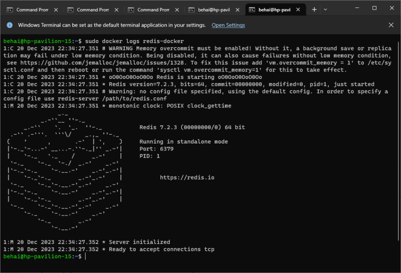

# Установка и настройка Redis в Docker (Windows 10 и Linux)

## 1. Скачать последний релиз Redis 
```bash
# Windows 10
docker pull redis

# Ubuntu 22.10
sudo docker pull redis
```

## 2. Создать Bridge Network для запуска Redis-CLI
```bash
# Windows 10
docker network create -d bridge redis-network

# Ubuntu 22.10
sudo docker network create -d bridge redis-network
```

## 3. Подготовить папку базы данных
Например, для Windows 10 имя папки `D:\Database\Redis` преобразуется в `//d/database/redis`, а для Ubuntu 22.20 папка базы данных будет называться `/home/behai/Public/database/redis`
```bash
# Windows 10
--mount type=bind,source=//d/database/redis,target=/data

# Ubuntu 22.10
--mount type=bind,source=/home/behai/Public/database/redis,target=/data
```

## 4.1 Запуск контейнера (со смотнтированными папками БД)
```bash
# Windows 10
docker run --publish=6379:6379 --network redis-network -d -it --mount type=bind,source=//d/database/redis,target=/data --name redis-docker redis

# Ubuntu 22.10
sudo docker run --publish=6379:6379 --network redis-network -d -it --mount type=bind,source=/home/behai/Public/database/redis,target=/data --name redis-docker redis
```

## 4.2 Запуск контейнера (без монтированных папок БД)
```bash
# Windows 10
docker run --publish=6379:6379 --network redis-network -d -it --name redis-docker redis

# Ubuntu 22.10
sudo docker run --publish=6379:6379 --network redis-network -d -it --name redis-docker redis
```

## 5. Проверка правильности запуска
```bash
# Windows 10
docker logs redis-docker

# Ubuntu 22.10
sudo docker logs redis-docker
```
Картина должна быть примерно такой:



Обратите внимание, чтобы в выводе не было следующей строки:
```cmd
# Warning: Could not create server TCP listening socket ::1:16379: bind: Cannot assign requested address
```

Теперь Redis готов

# Сохранение и восстановление образов
## Показать установленные образы
```bash
# Windows
docker images
```

## Сохраняем в tar-файл
```bash
docker save redis:latest --output E:\docker-images\redis-7-2-3-latest.tar
```

## Копирование из сохраненного образа
```bash
docker load --input E:\docker-images\redis-7-2-3-latest.tar
```


# Запуск Redis-CLI
## Запуск командной строки в образе
```bash
# Windows 10
docker exec -it redis-docker bash

# Ubuntu 22.10
sudo docker exec -it redis-docker bash
```

## Внутри командной строки образа ввести команду
```bash
redis-cli
```

